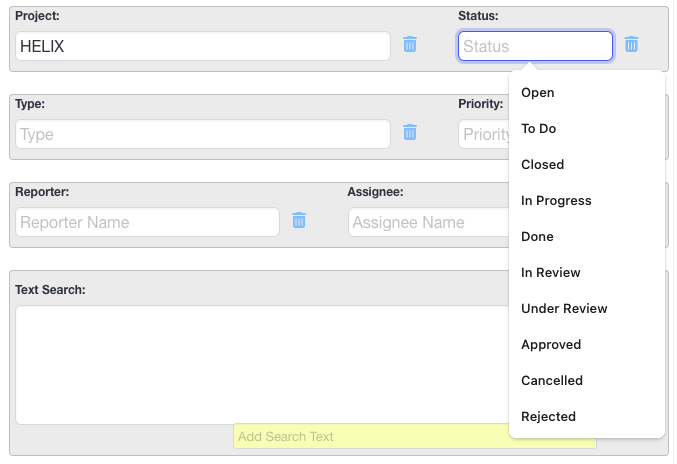

# TicketPad - User's Guide

<table align="center" style="border:0px solid #eee;width:100%">
  <tr style="border:0px solid #eee; width:100%">
   <td style="border:0px solid #eee;width:20%;">
&nbsp;
   </td>
    <td style="border:0px solid #eee; width:60%">

### Table of Contents

1. [Introduction](#introduction)
2. [Getting Started with TicketPad](#getting-started-with-ticketpad)
3. [Context Menu](#context-menu)
    * [Context Search](#context-search)
    * [Context Notes](#context-notes)
4. [SidePanel](#sidepanel)
    * [Search Tab](#search-tab)
    * [Notes Tab](#notes-tab)
5. [Options](#options)
6. [Troubleshooting](#troubleshooting)
7. [FAQs](#faqs)

    </td>
   <td style="border:0px solid #eee; width:20%">
&nbsp;
   </td>
  </tr>
</table>

# Introduction
The following guide provides an overview of the features and functionality of the TicketPad Chrome Extension. This extension uses a context menu and sidePanel to provide quick access to essential Jira features.

This guide will help you understand how to use the Search and Notes tabs in the sidePanel, as well as how to navigate the context menu. By the end of this guide, you should be able to effectively utilize TicketPad to streamline your workflow and improve your productivity.

# Getting Started with TicketPad

## Context Menu
In the Chrome browser (on Windows, macOS, and Linux), you can open the Context Menu by doing a right-click on the browser page.

**Note**: The Search and Notes menu items will be activated only when the SidePanel is open

### Behavior When Selecting "Search" from the Context Menu

- **From a normal web page**:

    The Search tab in the Side Panel will open.

- **From an HTML page displaying a Jira ticket** (e.g., https://[URL]/jira/browse/HELIX-871):

    The Search tab in the Side Panel will open, and the following fields will be automatically populated/updated based on the ticket details:

    - `Project:`: This field will be filled with the ticket's Project ID (in this example, HELIX). The value will also be saved in the dropdown menu if it is not already present.

    - `Look Up` **URL**: This will be automatically selected to match the ticket's site URL

    - `Reporter:`, `Assignee:`, and other relevant fields:
    The corresponding dropdown menus (including Reporter, Assignee, and any other applicable fields) will be automatically updated with the details from the current ticket. New values will be added to the dropdown menus if they are not already present.

        

        From the example we see the `Project:` field has been updated with the project name _HELIX_ and the `Status:` dropdown will be be updated with the status type, in this case, _Open_.

> [!NOTE]
> The dropdown menus will gradually populate with recent or frequently used items as you continue searching.

### Behavior When Selecting "Notes" from the Context Menu
edsdsdsdsd
Context Notes

## SidePanel

### Search Tab
(Insert detailed information about the Search tab, including examples and screenshots if necessary)

### Notes Tab
(Insert detailed information about the Notes tab, including examples and screenshots if necessary)

## Options
To access the Options dialog for TicketPad:

1. Go to the TicketPad icon in the Chrome Extensions panel, top right in Chrome Browser.
2. Right-click (or Ctrl+Click) on the icon to open the context menu.
3. Select "Options" from the drop-down menu.

This will open a popup panel with the following options:

### Note Managemen
* **Max Notes**: Set the maximum number of notes that can be created.
* **Max Note Size**: Set the maximum size each note can be.
* **Backup Notes**: Create a backup of all your notes, allowing you to restore them later.

### Export and Restore

* **Export Notes**: Download a CSV file containing all your notes.
* **HTML Report**: Export all your notes as an HTML table.
* **Restore Notes**: Restore all notes previously backed up.

By adjusting these options, you can customize the behavior of TicketPad to suit your needs.

## Troubleshooting
(Insert troubleshooting tips and solutions here)

## FAQs
(Insert frequently asked questions and their answers here)

> [!NOTE]
> Useful information that users should know, even when skimming content.

> [!TIP]
> Helpful advice for doing things better or more easily.

> [!IMPORTANT]
> Key information users need to know to achieve their goal.

> [!WARNING]
> Urgent info that needs immediate user attention to avoid problems.

> [!CAUTION]
> Advises about risks or negative outcomes of certain actions.