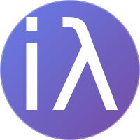
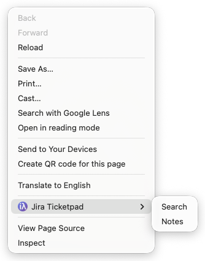
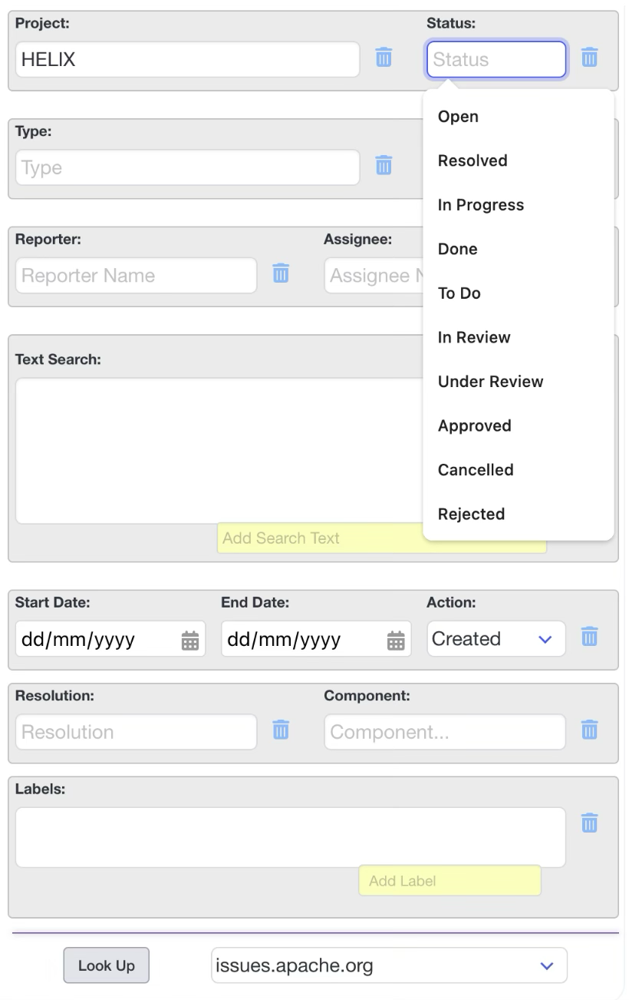
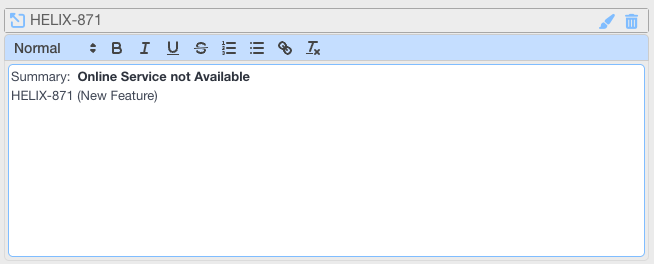
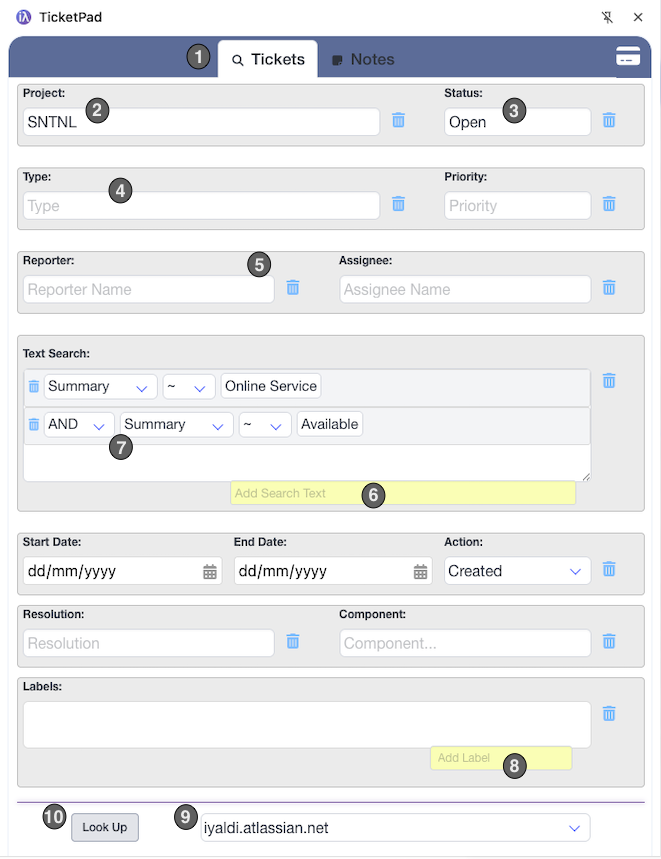
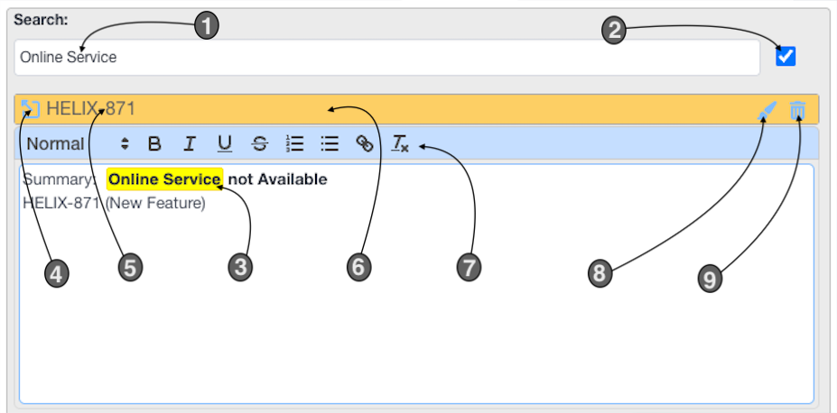
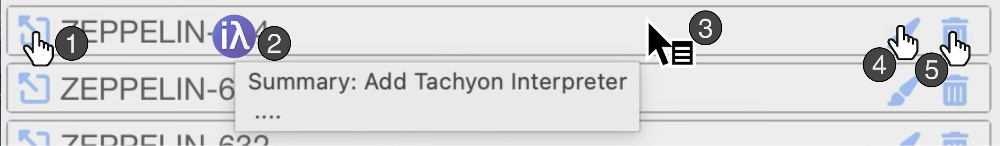
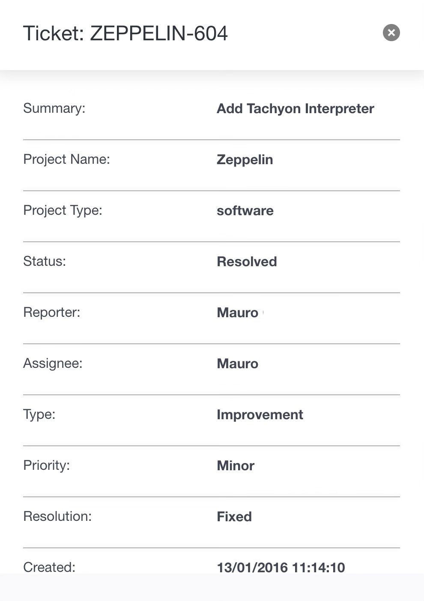
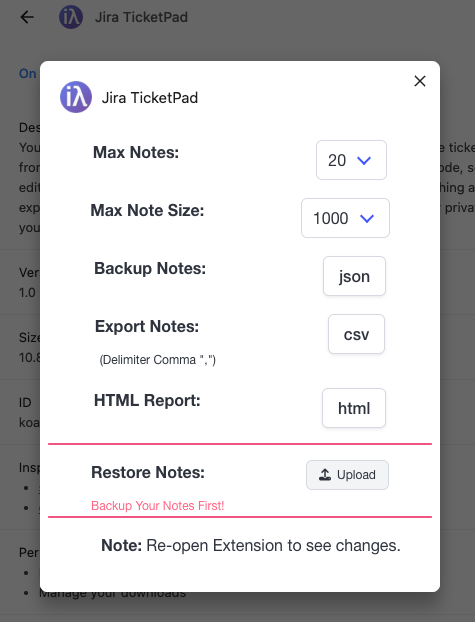

# TicketPad - User's Guide

<table align="center" style="border:0px solid #eee;width:100%">
  <tr style="border:0px solid #eee; width:100%">
   <td style="border:0px solid #eee;width:20%;">
&nbsp;
   </td>
    <td style="border:0px solid #eee; width:60%">

### Table of Contents

1. [Introduction](#introduction)
2. [Getting Started with TicketPad](#getting-started-with-ticketpad)
3. [Context Menu](#context-menu)
    * [Behaviour: Context Search](#behavior-when-selecting-search-from-the-context-menu)
    * [Behaviour: Context Notes](#behavior-when-selecting-notes-from-the-context-menu)
4. [Side Panel](#side-panel)
    * [Search Tab](#search-tab)
    * [Dropdown](#dropdowns)
    * [Notes Tab](#notes-tab)
5. [Options](#options)
    </td>
   <td style="border:0px solid #eee; width:20%">
&nbsp;
   </td>
  </tr>
</table>

# Introduction
In this comprehensive guide, we'll walk you through the features and functionality of TicketPad, a powerful extension designed to simplify your Jira experience. With its intuitive context menu and Side Panel, you'll be able to access essential Jira features with ease.

Throughout this guide, we'll explore how to utilize the Search and Notes tabs in the Side Panel, as well as master the context menu. By the end of our journey together, you'll be equipped to harness the full potential of TicketPad, streamlining your workflow and boosting your productivity.

Prepare for meetings with ease using TicketPad's powerful note-taking features.
By creating personalized Notes before a meeting, you'll be able to review and reference important information during the discussion. As you receive feedback, take Notes in real-time, summarizing key points and action items.
In your personal Notes, jot down vital details about each ticket, including:
	- How you intend to resolve or handle the issue
	- People you need to contact for further clarification or assistance
	- Any other relevant details that might not fit within a standard ticket description

To make your Notes more organized and visually appealing, use TicketPad's color-coding feature.
Assign colors to categorize your Notes based on urgency, priority, or any other criteria. This will allow you to group tickets together for quick reference, creating a visual guide of the meeting's key takeaways.
By leveraging TicketPad's note-taking capabilities, you'll be able to stay focused and productive during meetings, ensuring you leave with a clear understanding of action items and next steps.

Let's get started!

# Getting Started with TicketPad

## Context Menu
In the Chrome browser (on Windows, macOS, and Linux), you can open the Context Menu by doing a right-click on the browser page.

<!--  -->

**Note**: The Search and Notes menu items will be active only when the Side Panel is open.

### Behavior When Selecting "Search" from the Context Menu

- **From a generic web page**:

    The Search tab in the Side Panel will open.

- **From an HTML page displaying a Jira ticket** (e.g., https://[URL]/jira/browse/HELIX-871):

    The Search tab in the Side Panel will open, and the following fields will be automatically populated/updated based on the ticket details:

    - `Project:`: This field will be filled with the ticket's Project ID (in this example, HELIX). The value will also be saved in the dropdown menu if it is not already present.

    - `Look Up` **URL**: This will be automatically selected to match the ticket's site URL

    - `Reporter:`, `Assignee:`, and other relevant fields:
    The corresponding dropdown menus (including Reporter, Assignee, and any other applicable fields) will be automatically updated with the details from the current ticket. New values will be added to the dropdown menus if they are not already present.

<!--  -->

From the example we see the `Project:` field has been updated with the project name _HELIX_ and the `Status:` dropdown will be be updated with the status type, in this case, _Open_.

> [!NOTE]
> The dropdown menus will gradually populate with recent or frequently used items as you continue searching.

### Behavior When Selecting "Notes" from the Context Menu

- **From a normal web page**:
    The Notes tab in the Side Panel will open

- **From a web page displaying a Jira ticket** (e.g., https://[URL]/jira/browse/HELIX-871):
    The Notes tab in the Side Panel will be selected and if there is already a Note for this particular ticket, this note will be opened. If there is not already a Note for this particular ticket then a new note will be created with some ticket details:

<!--  -->

> [!TIP]
> If you select text in a Ticket that contains a ticket key then the Note will be for the selected ticket.

## Side Panel
Chrome Side Panel for extensions is a feature introduced in Chrome version 114 that allows browser extensions to display their own custom user interface in the browser's built-in side panel.

### Search Tab
The TicketPad Search tab is a game-changer for finding specific tickets.
With this feature, you can generate complex search patterns with ease, thanks to the intuitive UI that is automatically populated with information from your tickets. This means you can quickly select the right fields and values to search on, without having to manually craft your query.
And, as an added bonus, the TicketPad Search tab also prioritizes previous search parameters.

<!--  -->

1. Tabs to switch between the Ticket Search aid and the Notes.
2. The Project code will be pre-filled if you are coming from the Context menu Search and from on a valid ticket display.
3. The Status field has been filled, this can be done either form the dropdown list or typed.
4. Type, this is where you can select from the dropdown list or written. If it is left blank it will not be used then querying tickets.
5. The Reporter and Assignee names can be added by typing or selected from the dropdown list. The dropdown lists are continuesly being updated when you click on the Context Menu Search or Notes.
6. This is where you can add text to search in the tickets.
7. Where the text can be search is specified here, in `Summary`, `Text`, `Description` or `Comments`. The boolean can also be switch between `AND` and `OR`. The condition can also be modified betwwen `~` and `!~`, equal or not equal respectfully.
8. Here Labels can be selected or typed and added to the search.
9. As this Browser Extension supports more than one Ticket Server at one time, the URLs are also set so you can search on more than one server.
10. `Look Up`, clicking this button generates the search pattern and the search is executed in the browser's main window.

### Dropdowns

TicketPad dropdowns work as follows:

When you click on an input field, a dropdown list appears below the field. This list is automatically populated with items from your previous searches and notes made from the context menu.

As you use the dropdown items more frequently, they will rise to the top of the list, making it easier for you to access them quickly. Conversely, if you don't use certain items often enough, they will gradually be removed from the list as new items are added, helping to keep your dropdown lists organized and clutter-free.

This way, you can easily find and reuse previously used values, while also keeping the dropdown lists tidy and efficient. 

| Field             | Description | Limit  |
| :---------------- | :---- | :----: |
| **Project**           |  Project Code refers to a unique identifier assigned to each project in your instance. This code serves as a shorthand reference for the project name. In TicketPad, we recommend using the Project Code to quickly identify and access relevant projects. You can do this by selecting the Project Code from the dropdown list when searching for tickets.| 20   |
| **Status**            | Status refers to the current state of an issue or ticket within a project. It's a critical field that helps teams track the progress of their work and identify areas where they may need assistance. TicketPad allows you to easily view and update the status of your tickets directly from the Side Panel. You can also use the Status field to filter tickets based on their current state, making it simpler to focus on specific tasks or workflows. By leveraging TicketPad's Status features, you can stay up-to-date with the latest developments in your projects    | 20   |
| **Type**              |  Type refers to the category or classification of an issue or ticket within a project. This field helps teams organize and prioritize their work by grouping similar issues together. TicketPad allows you to easily view and filter tickets based on their type, making it simpler to focus on specific tasks or workflows.    | 20   |
| **Priority**          |  Priority refers to the level of importance assigned to an issue or ticket within a project. This field helps teams prioritize their work by grouping high-priority items at the top of their list. TicketPad allows you to easily view and filter tickets based on their priority, making it simpler to focus on critical tasks or workflows. By leveraging TicketPad's Priority features, you can stay focused on high-priority tasks and ensure that your team is addressing the most important issues first.    | 20   |
| **Reporter**          |  Reporter refers to the person who creates an issue or ticket within a project. This field helps teams track the source of each issue and assign responsibilities accordingly. TicketPad allows you to easily view and filter tickets based on their reporter, making it simpler to identify the origin of specific issues and collaborate with team members who created them. By leveraging TicketPad'is Reporter features, you can streamline your workflow by quickly identifying who reported an issue and what actions they took.    | 30   |
| **Assignee**          |  Assignee refers to the person responsible for resolving or handling an issue or ticket within a project. This field helps teams track ownership and assign tasks accordingly. TicketPad allows you to easily view and filter tickets based on their assignee, making it simpler to identify who is responsible for each issue and collaborate with team members who are working on them. By leveraging TicketPad'is Assignee features, you can streamline your workflow by quickly identifying who is responsible for an issue and what actions they have taken.    | 30   |
| **Resolution**        |  Resolution refers to the outcome or result of resolving an issue or ticket within a project. This field helps teams track the status of each issue and identify patterns or trends. TicketPad allows you to easily view and filter tickets based on their resolution, making it simpler to focus on specific outcomes or results. By leveraging TicketPad'is Resolution features, you can streamline your workflow by quickly identifying the outcome of each issue and what actions were taken to resolve them.    | 20   |
| **Component**         |  Component refers to a specific part or module within a project that is responsible for delivering certain functionality. This field helps teams organize their work by grouping similar issues together based on the component they belong to. TicketPad allows you to easily view and filter tickets based on their component, making it simpler to focus on specific areas of your project and collaborate with team members who are working on them. By leveraging TicketPad'is Component features, you can streamline your workflow by quickly identifying which component an issue belongs to and what actions were taken to resolve it.    | 20   |
| **Labels**            | Labels are keywords or tags that can be applied to issues or tickets within a project. These labels help teams categorize and filter their work based on specific topics, themes, or priorities. TicketPad allows you to easily view and filter tickets based on their labels, making it simpler to focus on specific areas of your project and collaborate with team members who are working on them. By leveraging TicketPad's Label features, you can streamline your workflow by quickly identifying which labels an issue belongs to and what actions were taken to resolve it     | 20   |

### Notes Tab
The Notes Tab in TicketPad is indeed a fantastic feature for storing and organizing your thoughts and ideas.
This tab allows you to list each note with its own text editor, making it easy to update and modify them as needed. 

The search field at the top is also super useful for quickly finding specific notes among all the others.
With the case-sensitive search option! By selecting the checkbox, you can refine your search results even further to get more precise matches.

By leveraging TicketPad's Notes Tab features, you can streamline your workflow by keeping track of important notes and ideas in one place.

<!--  -->

1. Search Field, this field allows you to search all your notes. 
2. Case Sensitive checkbox.
3. Searched words will be highlighted.
4. Click to open ticket in browser.
5. Click ticket number will open popup with ticket status.
6. Click to open or close Note.
7. Editor toolbar for Note.
8. Change Note's title bar colour.
9. Delete Note.

#### Note Toolbar

<!--  -->

The Notes Toolbar in TicketPad features a dynamic cursor icon system that adapts to your mouse movements. As you hover over different sections of the toolbar, you will notice the cursor icons changing to indicate specific actions.

Here is a breakdown of what each cursor icon does:

1. Pointer: Clicking this icon will open the ticket in the browser.

2. i&#955;: Clicking here will open the popup dialog displaying the current Ticket Status of the ticket. Hovering over this section will also display a tooltip with the first lines of the Note.

3. Context Menu: Clicking here will toggle the Note section open and close.

4. Pointer - Color Picker: A popup dialog opens, allowing you to change the color of the Note Toolbar.

5. Pointer - Delete Note: Clicking this icon will delete the current note.

By leveraging these intuitive cursor icons, you can quickly access the features you need without having to navigate through menus or dialogue boxes. 

#### Ticket Status (Dialog)

Ticket Status popup dialog displays the current situation of the selected ticket.

<!--  -->

## Options
To access the Options dialog for TicketPad:

1. Go to the TicketPad icon in the Chrome Extensions panel, top right in Chrome Browser.
2. Right-click (or Ctrl+Click) on the icon to open the context menu.
3. Select "Options" from the drop-down menu.

<!--  -->

This will open a popup panel with the following options:

### Notes Management
* **Max Notes**: Set the maximum number of notes that can be created.
* **Max Note Size**: Set the maximum size each note can be.

By adjusting these options, you can customize the behavior of TicketPad to suit your needs.

> [!TIP]
> Keep the number of Notes and size of your Notes as small as possible, this will reduce resource usage and help with your Notes organization. Backup your Notes regularly and start a fresh, you can always restore then if needed.

### Export and Restore

* **Backup Notes**: Create a backup of all your notes, allowing you to restore them later.
* **Export Notes**: Download a CSV file containing all your notes.
* **HTML Report**: Export all your notes as an HTML table, click the download and it will be displayed in your default browser.
* **Restore Notes**: Restore all notes previously backed up. (All backups are dated)

> [!CAUTION]
> Restoring Notes will overwrite existing notes. Make sure you Backup Notes first.

<!--  -->
<!--  -->
<!-- ## Troubleshooting -->
<!-- (Insert troubleshooting tips and solutions here) -->
<!--  -->
<!-- ## FAQs -->
<!-- (Insert frequently asked questions and their answers here) -->
<!--  -->
<!--  -->
<!-- > [!NOTE] -->
<!-- > Useful information that users should know, even when skimming content. -->
<!--  -->
<!-- > [!TIP] -->
<!-- > Helpful advice for doing things better or more easily. -->
<!--  -->
<!-- > [!IMPORTANT] -->
<!-- > Key information users need to know to achieve their goal. -->
<!--  -->
<!-- > [!WARNING] -->
<!-- > Urgent info that needs immediate user attention to avoid problems. -->
<!--  -->
<!-- > [!CAUTION] -->
<!-- > Advises about risks or negative outcomes of certain actions. -->
<!--  -->